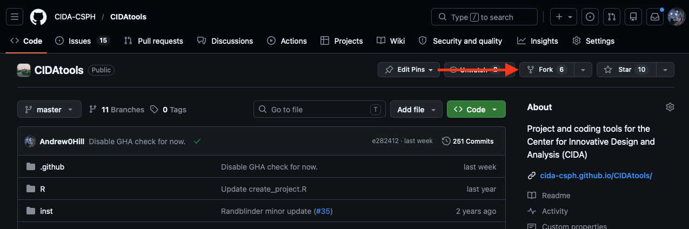

# Contributing

We are interested in contributions from any CIDA member!

For organization and tracking purposes, we ask that all contributions are submitted through GitHub. 

## Submitting an Issue
To submit an issue, navigate to the [Issues](https://github.com/CIDA-CSPH/RT_Test_Site/issues) page for this repository. 

When creating an issue, you can assign specific 'tags' which relate to the type of request you are making (i.e. bug report, request for a new article, etc.)

The GitHub issues page is useful for:
- **Bug/Issue Reports** - Reports for broken links, visual bug, outdated/incorrect information, etc.
- **Article/Tutorial Requests** - If you would like to have a tutorial/article/vignette generated for a specific topic, feel free to submit an issue!

## Submitting a Pull Request

We will also accept pull requests from CIDA members:
- **Content Edits and Updates** - If you identify an issue with the site, or have suggested edits to existing content, we are happy to merge these in via pull request!
- **Articles/Tutorials/Vignettes** - If you want to share your expertise in a specific area via an article, tutorial, or vignette, feel free to submit a pull request and we will merge your contributions into the site!

See the [Make Changes to CIDA RT Knowledge Base](#make-changes-to-cida-rt-knowledge-base) section for detailed instructions on how to set up a local environment for contributing to the site.

## Making Changes

This site uses the [Zensical](https://zensical.org) static site generator, which generates a fully-featured HTML documentation site from standard Markdown (`.md`) documents. 

The raw `.md` files are located in the `docs/` folder, and the `mkdocs.yml` file defines the structure (table of contents sidebar, categories, etc).

### 1. Fork the repository
Forking the RT_Test_Site repository creates a copy of the repository under your own GitHub username, which you can then edit freely. 

You can create a fork using the 'Fork' button on the main repository:



### 2. Clone the forked repository
You can clone your fork of the site repository using any method you find convenient (command line, RStudio, etc).

```shell
git clone https://<your_github_username>/RT_Test_Site.git
```

### 3. Configure local site builds (Optional)

Since articles are written in Markdown (`.md`) format, it is possible to make changes/edits and use the RStudio/VSCode Markdown preview to visualize the result.

However, for more complex edits, or for generating new articles with tables, figures, etc it is beneficial to configure a local site build. This will allow you to view a local version of the site with your changes applied, so you can visualize what the resulting HTML page will look like when deployed.

To configure a local environment to build the site, first install the `uv` environment manager. `uv` is available for all operating systems (and can be obtained via homebrew on Mac).

Once uv is installed, run:

```shell
uv sync
```

to install Python and configure all project dependencies.

To generate a local build of the site, run:

```shell
uv run zensical serve
```

This will start a development server which will build the site and host it locally on your machine at `localhost:8000`. 

As you make changes to the (`.md`) files in the `docs/` directory, your changes should be reflected live in the local version of the site. 

### 4. Commit your changes

As you work on your contribution, you can commit and push changes to your local fork using the usual `git add`, `git commit`, `git push` routine.

### 5. Open a Pull Request

To merge your contribution into the main site, visit the page for your fork on GitHub, and select the `Contribute -> Open Pull Request` option.

