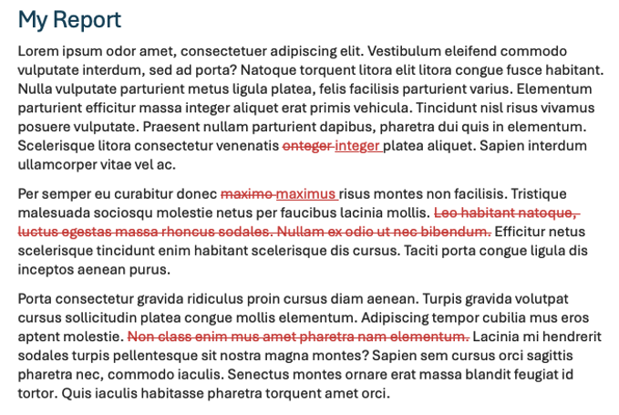
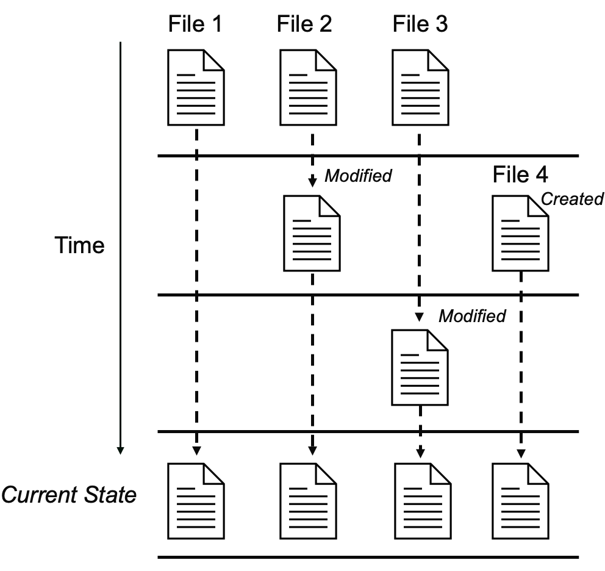

# 01 - Git/GitHub Setup

**Audience:** First-time Git/GitHub Users

This article provides a high-level description of Version Control, describes how to install Git and create a GitHub account, and covers some basic configuration steps. 

If you already have experience with these tools, feel free to use the sidebar to skip to relevant sections, or skip to the next article in the series.

## What is Version Control?

In the past, you may have encountered a situation like this:

<figure>
    
    <figcaption>'Manual' Version Control</figcaption>
</figure>

The above example shows a manual form of **Version Control**, where the user manually maintains multiple copies/versions of files. 

Although this type of version control can be functional in the short-term, over time it can become convoluted, introduce errors, and hinder reproducibility and collaboration.

For these reasons, we encourage CIDA members to use Git, a type of **Version Control System** (VCS).

**Version Control Systems** like Git can be used to track changes to files (reports, code, etc) during development, and to organize/synchronize contributions from multiple individuals.

Even if you have never used Git/GitHub before, you may *have* encountered **Version Control** before, in the form of the 'Track Changes' and 'Version History' features in programs like Microsoft Word and Google Docs.
<figure>
    
    <figcaption>Track Changes in Microsoft Word</figcaption>
</figure>


**Version Control Systems** can be used to:

1. Maintain a complete development history for your project (**what changes** were made to **which files**, and **when**).
    <figure>
        
        <figcaption>File Changes over Time</figcaption>
    </figure>
2. Manage and synchronize code contributions from multiple developers or systems.
    <figure>
        
        <figcaption>Multiple Code Contriubutors</figcaption>
    </figure>

## Introduction to Git

<figure>
    
    <figcaption>Git Logo</figcaption>
</figure> 

[Git](https://git-scm.com) is a **Version Control** tool which allows users to track file changes and synchronize changes between local and remote (online) locations.

Git was first released in 2005 as an open-source tool for managing the Linux kernel source code, and has since become the Version Control software of choice for most developers. 

<figure>
    
    <figcaption>'What are the primary version control systems you use?' <a href="https://survey.stackoverflow.co/2022#version-control-version-control-system">StackOverflow 2022 Developer Survey</a> </figcaption>
</figure>


## Introduction to GitHub

<figure>
    
</figure> 

GitHub is a popular web service which integrates with Git, allowing users to host remote/online versions of their Git repositories.

GitHub was founded in 2008 and purchased by Microsoft in 2018. 

Users can configure their local Git repository to send and receive changes from a remote GitHub repository, allowing them to share code online and develop software collaboratively. 


**Note:** Other popular GitHub alternatives are GitLab and self-hosted/internal Git servers.

## Git Installation

**Tip:** OS-specific video walkthroughs of the steps below are available [here on OneDrive](https://olucdenver-my.sharepoint.com/:f:/g/personal/andrew_2_hill_cuanschutz_edu/IgBaTDV-g2tnT7Im_kgZjciaARO8wuXefaq4p7H9IIyyxuo?e=kYdJaw) (CU email required).

### 1. Check for existing Git installation

Before installing Git, we can check to see if Git is already installed on the machine.

Open a **Terminal** (Mac) or **Powershell** (Windows) instance, type `git`, and press Enter.

On **Windows**, a message like:

```
git : The term 'git' is not recognized as the name of a cmdlet...
```
indicates that `git` is not yet installed.

On **Mac**, attempting to execute `git` when it is not installed will produce a mesage like:

```
xcode-select: note: No developer tools were found, requesting install.
```

and trigger a pop-up prompt to install the `Command Line Developer Tools`. 

*(If Git is not installed, continue to the Step 2 for your operating system)*

### 2. Installing Git (Windows)

On Windows, you can download Git from the official Git website ([https://git-scm.com/install/](https://git-scm.com/install/)). We recommend downloading the `Git for Windows/x64 Setup`.

<figure>
    
    <figcaption>Git Download Page</figcaption>
</figure> 

After downloading, run the installer. Default installation options are fine with two exceptions:

1. We recommend setting the default branch name to `main` (from `master`)
    <figure>
        
        <figcaption>Override Default Branch Name</figcaption>
    </figure> 
2. Ensure that 'Git Credential Manager' is selected for installation along with Git.
    <figure>
        
        <figcaption>Git Credential Manager</figcaption>
    </figure> 

Once the install is complete, you can open a *new* PowerShell window to verify that Git is installed.

<figure>
    
    <figcaption>Successful Git Installation (Windows)</figcaption>
</figure> 

### 2a. Installing Git (Mac)

If you performed [Step 1](#1-check-for-existing-git-installation) on a Mac, you may have encountered a pop-up prompting you to install the Command Line Developer Tools.

<figure>
    
    <figcaption>Command-line Tools Install Prompt</figcaption>
</figure> 

Simply select **Install** and wait for the system to finish the installation. 

After installing, you should be able to type `git` into the open **Terminal** window to verify that Git is installed.

<figure>
    
    <figcaption>Successful Git Installation (Mac)</figcaption>
</figure> 

### 2b. Installing Git Credential Manager (Mac-only)

If you are following the *Mac* steps above, you will need to install **Git Credential Manager** separately. This program is included in the Windows installer, but must be installed separately for Mac.

You can download Git Credential Manager from the [Git Credential Manager GitHub repository](https://github.com/git-ecosystem/git-credential-manager/releases/): 

Under the **Assets** section, choose either `gcm-osx-arm64-*.pkg` or `gcm-osx-x64-*.pkg`, depending on your architecture. 

<figure>
    
    <figcaption>Git Credential Manager Packages</figcaption>
</figure> 

If you are not sure, navigate to ` → About This Mac` on the top bar and check the processor name under **Chip**:

- `Apple *` → Download the `gcm-osx-arm64-*.pkg`,
- `Intel *` → Download the `gcm-osx-x64-*.pkg`

<figure>
    
    <figcaption>About This Mac<br>(Apple/ARM64 Chip)</figcaption>
</figure> 

**TODO:** Andrew to finish this