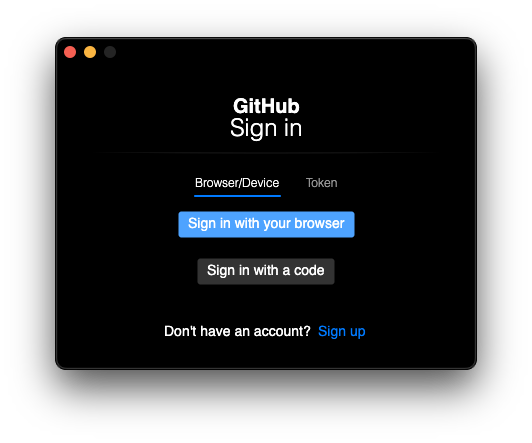
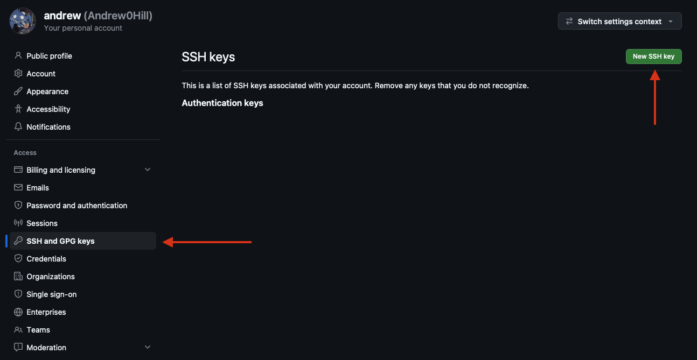
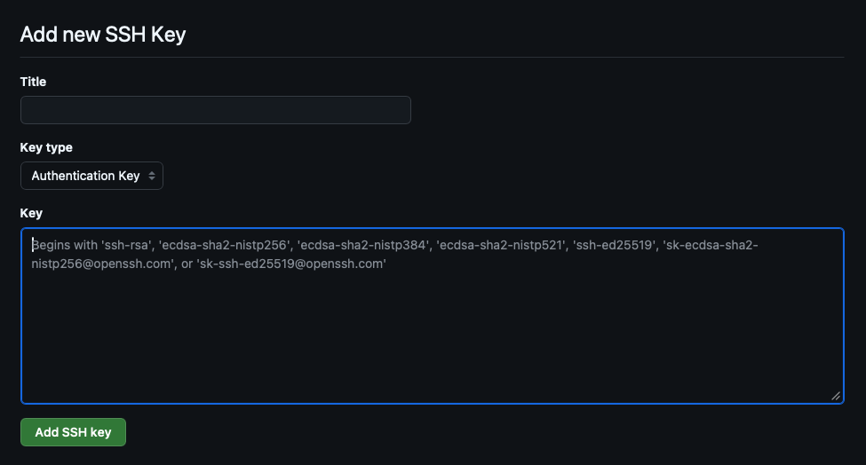

# 01 - Git/GitHub Setup

**Audience:** First-time Git/GitHub Users

This article introduces the concept of Version Control by providing some motivation and background info, then provides steps for installing Git and setting up a GitHub account.

If you already have Git/GitHub configured, feel free to skip to the [next article](github_basics_02.md) in the series.

## What is version control?

Version control simply means *tracking changes to a set of files over time*, typically with the ability to access to previous versions of the files if needed.

When people refer to 'using version control', they are typically referring to the use of a **Version Control System** or **VCS**, a software tool designed to track changes and state for multiple files within a project.

## Why do we need version control?

*CIDA members are encouraged (required?) to use a dedicated version control system (specifically **Git**) to manage each of their projects*.

For CIDA members, Git enables us to create reproducible analytical code bases, where the full history of the analysis is available to ourselves and those which we choose to share it with.

In the past, you may have encountered a situation like this:

<figure>
    
    <figcaption>'Manual' Version Control</figcaption>
</figure>

The above example shows a manual form of version control. The user is manually maintaining multiple copies/versions of report and code files and preserving older versions as they make changes.

This type of version control is functional in the short-term, but over time it can become convoluted, introduce errors, and hinder reproducibility and collaboration.

A dedicated VCS like Git is designed to solve this problem. Git can handle arbitrarily sized projects, and can track any type of file (Scripts/Notebooks, Reports, Tables/Figures, etc)

## Introduction to Git and Version Control

<figure>
    
    <figcaption>Git Logo</figcaption>
</figure> 

Git was first released in 2005 as an open-source tool for managing the Linux kernel source code. Since then, it has become the VCS of choice for most developers. 

!!! info "Fun Fact"
    The Linux kernel surpassed *40 million lines of code* in 2025, with contributions from over 5000 developers in 2025 alone. [^1]

<figure>
    
    <figcaption>'What are the primary version control systems you use?' <a href="https://survey.stackoverflow.co/2022#version-control-version-control-system">StackOverflow 2022 Developer Survey</a> </figcaption>
</figure>

[^1]: https://commandlinux.com/statistics/linux-kernel-contributors-lines-of-code-statistics/

Git can be used to maintain a complete version history for your project files:

- *What changes have been made to each file?*
- *Who made the changes?*
- *When were the changes made?*
<figure>
    
    <figcaption>Example of a Git Repository</figcaption>
</figure>

A **Git Repository** is a term used to describe a group of files tracked by Git. In general, it is good practice to create separate Git Repositories for each of your projects.

*For now we just introduce the high-level concept, but in the [next article](github_basics_02.md) we will cover how to create and use a Git repository.*

## Creating a GitHub Account
<figure>
    
</figure> 

On its own, Git is a powerful version control tool. However, one of the other benefits of version control is the ability to back up code online, and *share* code with others.

To allow for this, Git has the concept of a **remote repository**, an online location which mirrors a **local repository** located on your computer.

<figure>
    
</figure>

After configuring a remote repository, you can send changes to (**push**) or receive changes from (**pull**) the remote repository. 


Although there are many options for hosting remote Git repositories, the most popular is **GitHub**. 

!!! note "CIDA GitHub Organization"
    CIDA has an official GitHub organization, which members can use to store code securely and collaborate with others. If you are a new CIDA member and need access to the CIDA GitHub organization, please email:

    <a href="mailto:cida-rt@olucdenver.onmicrosoft.com">cida-rt@olucdenver.onmicrosoft.com</a>


## Git Installation

To get started using Git, we first need to install Git on our local machine. 

!!! Example "Tip"
    If you prefer instructions in video format, video walkthroughs of the steps below are available [here on OneDrive](https://olucdenver-my.sharepoint.com/:f:/g/personal/andrew_2_hill_cuanschutz_edu/IgBaTDV-g2tnT7Im_kgZjciaARO8wuXefaq4p7H9IIyyxuo?e=kYdJaw) (CU email required) for both **Windows** and **Mac**.

### 1. Check for existing Git installation

Before installing Git, we can check to see if Git is already installed on the machine.

Open a **Terminal** (Mac) or **Powershell** (Windows) window, type `git`, and press Enter.

On **Windows**, a message like:

```
git : The term 'git' is not recognized as the name of a cmdlet...
```
indicates that `git` is not yet installed.

On **Mac**, attempting to execute `git` when it is not installed will produce a mesage like:

```
xcode-select: note: No developer tools were found, requesting install.
```

and trigger a pop-up prompt to install the `Command Line Developer Tools`. 

*(If Git is not installed, continue to the Step 2 for your operating system)*

### 2. Installing Git (Windows)

On Windows, you can download Git from the official Git website ([https://git-scm.com/install/](https://git-scm.com/install/)). We recommend downloading the `Git for Windows/x64 Setup`.

<figure>
    
    <figcaption>Git Download Page</figcaption>
</figure> 

After downloading, run the installer. Default installation options are fine with two exceptions:

1. We recommend setting the default branch name to `main` (from `master`)
    <figure>
        
        <figcaption>Override Default Branch Name</figcaption>
    </figure> 
2. Ensure that 'Git Credential Manager' is selected for installation along with Git.
    <figure>
        
        <figcaption>Git Credential Manager</figcaption>
    </figure> 

Once the install is complete, you can open a *new* PowerShell window to verify that Git is installed.

<figure>
    
    <figcaption>Successful Git Installation (Windows)</figcaption>
</figure> 

### 2a. Installing Git (Mac)

If you performed [Step 1](#1-check-for-existing-git-installation) on a Mac, you may have encountered a pop-up prompting you to install the Command Line Developer Tools.

<figure>
    
    <figcaption>Command-line Tools Install Prompt</figcaption>
</figure> 

Simply select **Install** and wait for installation to complete. 

After installing, you should be able to type `git` into the open **Terminal** window to verify that Git is installed.

<figure>
    
    <figcaption>Successful Git Installation (Mac)</figcaption>
</figure> 

### 2b. Installing Git Credential Manager (Mac-only)

If you are installing for **Mac**, you will need to install **Git Credential Manager** separately. This program is included in the Windows installer, but must be installed separately for Mac.

You can download Git Credential Manager from the [Git Credential Manager GitHub repository](https://github.com/git-ecosystem/git-credential-manager/releases/): 

Under the **Assets** section, choose either `gcm-osx-arm64-*.pkg` or `gcm-osx-x64-*.pkg`, depending on your computer's architecture. 

<figure>
    
    <figcaption>Git Credential Manager Packages</figcaption>
</figure> 

If you are not sure, navigate to ` → About This Mac` on the top bar and check the processor name under **Chip**:

- `Apple *` → Download the `gcm-osx-arm64-*.pkg`,
- `Intel *` → Download the `gcm-osx-x64-*.pkg`

<figure>
    
    <figcaption>About This Mac<br>(Apple/ARM64 Chip)</figcaption>
</figure> 

You can also type the `arch` command in **Terminal** to print the architecture.


## Git Configuration

### Configuring `user.name` and `user.email`

After installing Git, your next step should be to configure your Git user name and email.

Open a Terminal or Powershell window and run the following two commands:

```{shell}
git config --global user.name <GitHub Username>
git config --global user.email <GitHub Email Address>
```

!!! info
    Be sure to use your GitHub username and the same email address you used when signing up for GitHub to ensure your commits are attributed to your account.

### Obtaining Git Credentials

If using Git Credential Manager, there is no need to directly create GitHub token or key, as Git Credential Manager will prompt you to log in via GitHub the first time you perform a Git operation that requires authentication.

<figure>
    
    <figcaption>GitHub login prompt, seen after running a <code>git pull</code> for the first time using GCM.</figcaption>
</figure> 


### Alternative Method - Git SSH Credentials

SSH key is an option for GitHub authentication in cases where Git Credential Manager is not available (i.e. on a HPC or other shared system, etc.)

To create an SSH key, open a Terminal or Powershell and run the following command:

```
ssh-keygen
```

If you have already created an SSH key, pay attention to the default key path, as it may overwrite your existing key.

<figure>
    
    <figcaption>Screenshot showing the ssh-keygen command (blue arrow), the location where the key was written (orange arrow), and the contents of the public key file (purple arrow)</figcaption>
</figure> 

Open or print out the **.pub** key file and copy the contents (example shown above by the purple arrow).

!!! info 
    SSH key creation will create two files, one without an extension, and one with a `.pub` extension. Make sure to copy the contents of the public key (`.pub`) file, not the private key (no extension) file. 

Navigate to GitHub -> Settings and select the 'SSH and GPG Keys' section on the sidebar. Now, click the green 'New SSH key' button on the top right of the page.

<figure>
    
    <figcaption>GitHub SSH Key Settings Location</figcaption>
</figure> 

This will open a prompt asking you for your SSH key:

<figure>
    
    <figcaption>GitHub SSH Key Entry Field</figcaption>
</figure> 

Paste the contents of the public key into the 'Key' field, and click the green 'Add SSH key' button.

Congratulations, you have added a new SSH key!

!!! info "Cloning via SSH"
    If the SSH key you created does not live at the default path suggested by `ssh-keygen`, Git will not use your SSH key for authentication by default.
    The easiest way to get Git to use your SSH key is to add a host entry for GitHub in your SSH config file.

    Navigate to (or create) `~/.ssh/config` and add an entry as follows:
    ```
    Host github.com
	    IdentityFile <path to your private key>
    ```

    This will tell SSH to authenticate with your key when connecting to github.com via SSH.

## Conclusion

In this article, we covered the basics of version control, creating a GitHub account, installing Git, and some basic configuration.

In future articles, we will cover how to actually *use* Git for our projects.
