# 01 - Git/GitHub Setup

**Audience:** First-time Git/GitHub Users

This article introduces the concept of Version Control by providing some motivation and background info, then provides steps for installing Git and setting up a GitHub account.

If you already have Git/GitHub configured, feel free to skip to the [next article](github_basics_02.md) in the series.

## What is version control?

Version control simply means *tracking changes to a set of files over time*, typically with the ability to access to previous versions of the files if needed.

When people refer to 'using version control', they are typically referring to the use of a **Version Control System** or **VCS**, a software tool designed to track changes and state for multiple files within a project.

## Why do we need version control?

*CIDA members are encouraged (required?) to use a dedicated version control system (specifically **Git**) to manage each of their projects*.

For CIDA members, Git enables us to create reproducible analytical code bases, where the full history of the analysis is available to ourselves and those which we choose to share it with.

In the past, you may have encountered a situation like this:

<figure>
    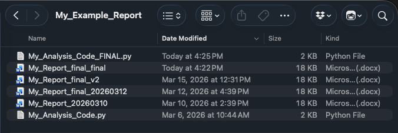
    <figcaption>'Manual' Version Control</figcaption>
</figure>

The above example shows a manual form of version control. The user is manually maintaining multiple copies/versions of report and code files and preserving older versions as they make changes.

This type of version control is functional in the short-term, but over time it can become convoluted, introduce errors, and hinder reproducibility and collaboration.

A dedicated VCS like Git is designed to solve this problem. Git can handle arbitrarily sized projects, and can track any type of file (Scripts/Notebooks, Reports, Tables/Figures, etc)

## Introduction to Git and Version Control

<figure>
    
    <figcaption>Git Logo</figcaption>
</figure> 

Git was first released in 2005 as an open-source tool for managing the Linux kernel source code. Since then, it has become the VCS of choice for most developers. 

<figure>
    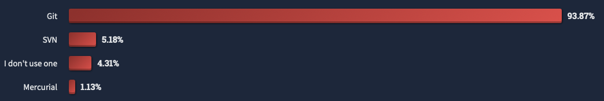
    <figcaption>'What are the primary version control systems you use?' <a href="https://survey.stackoverflow.co/2022#version-control-version-control-system">StackOverflow 2022 Developer Survey</a> </figcaption>
</figure>


Git can be used to:

1. Maintain a complete history for your project:
    - *What changes have been made to each file?*
    - *Who made the changes?*
    - *When were the changes made?*
    <figure>
        
        <figcaption>File Changes over Time</figcaption>
    </figure>
2. Manage and synchronize code contributions from multiple developers or systems:
    <figure>
        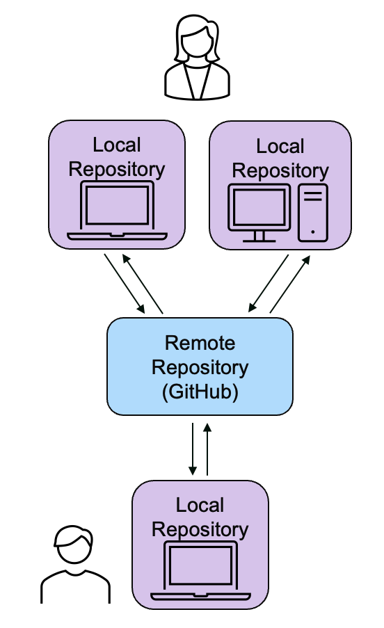
        <figcaption>Multiple Code Contriubutors</figcaption>
    </figure>

## Introduction to GitHub

<figure>
    
</figure> 

GitHub is a popular web service which integrates with Git, allowing users to host remote/online versions of their Git repositories.

GitHub was founded in 2008 and purchased by Microsoft in 2018. 

Users can configure their local Git repository to send and receive changes from a remote GitHub repository, allowing them to share code online and develop software collaboratively. 


**Note:** Other popular GitHub alternatives are GitLab and self-hosted/internal Git servers.

### Creating a GitHub Account

## Git Installation

**Tip:** OS-specific video walkthroughs of the steps below are available [here on OneDrive](https://olucdenver-my.sharepoint.com/:f:/g/personal/andrew_2_hill_cuanschutz_edu/IgBaTDV-g2tnT7Im_kgZjciaARO8wuXefaq4p7H9IIyyxuo?e=kYdJaw) (CU email required).

### 1. Check for existing Git installation

Before installing Git, we can check to see if Git is already installed on the machine.

Open a **Terminal** (Mac) or **Powershell** (Windows) instance, type `git`, and press Enter.

On **Windows**, a message like:

```
git : The term 'git' is not recognized as the name of a cmdlet...
```
indicates that `git` is not yet installed.

On **Mac**, attempting to execute `git` when it is not installed will produce a mesage like:

```
xcode-select: note: No developer tools were found, requesting install.
```

and trigger a pop-up prompt to install the `Command Line Developer Tools`. 

*(If Git is not installed, continue to the Step 2 for your operating system)*

### 2. Installing Git (Windows)

On Windows, you can download Git from the official Git website ([https://git-scm.com/install/](https://git-scm.com/install/)). We recommend downloading the `Git for Windows/x64 Setup`.

<figure>
    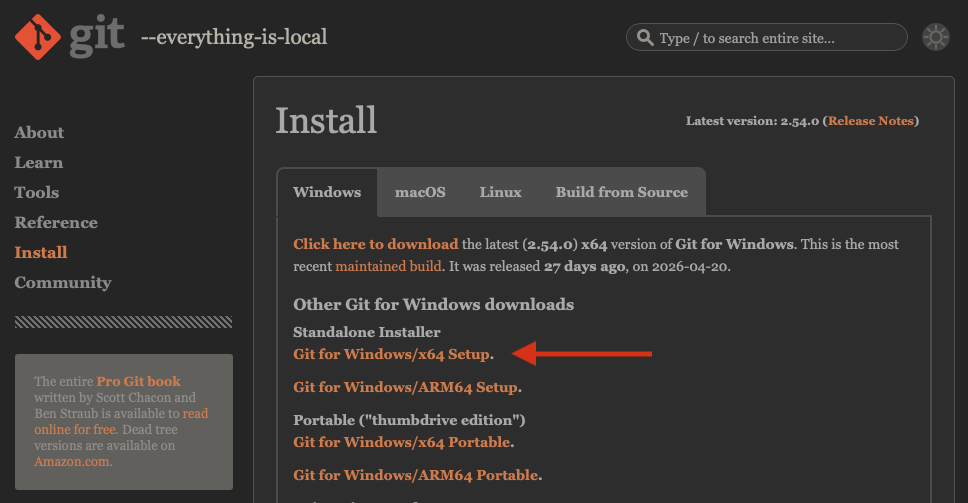
    <figcaption>Git Download Page</figcaption>
</figure> 

After downloading, run the installer. Default installation options are fine with two exceptions:

1. We recommend setting the default branch name to `main` (from `master`)
    <figure>
        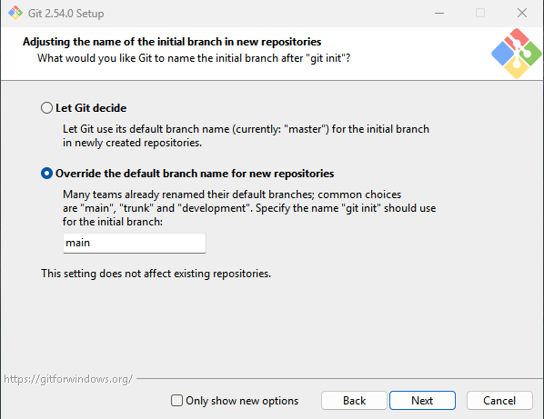
        <figcaption>Override Default Branch Name</figcaption>
    </figure> 
2. Ensure that 'Git Credential Manager' is selected for installation along with Git.
    <figure>
        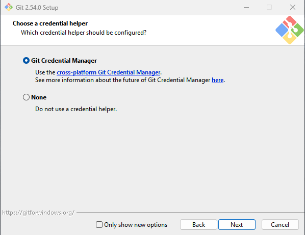
        <figcaption>Git Credential Manager</figcaption>
    </figure> 

Once the install is complete, you can open a *new* PowerShell window to verify that Git is installed.

<figure>
    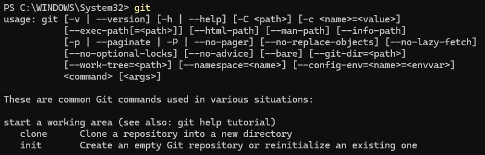
    <figcaption>Successful Git Installation (Windows)</figcaption>
</figure> 

### 2a. Installing Git (Mac)

If you performed [Step 1](#1-check-for-existing-git-installation) on a Mac, you may have encountered a pop-up prompting you to install the Command Line Developer Tools.

<figure>
    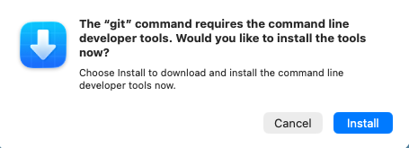
    <figcaption>Command-line Tools Install Prompt</figcaption>
</figure> 

Simply select **Install** and wait for the system to finish the installation. 

After installing, you should be able to type `git` into the open **Terminal** window to verify that Git is installed.

<figure>
    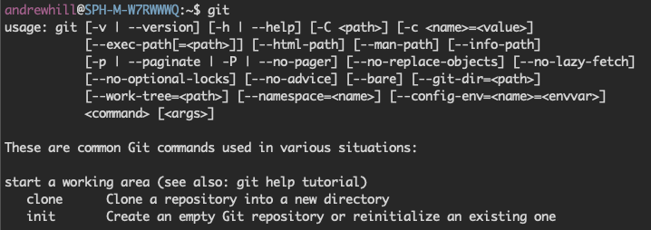
    <figcaption>Successful Git Installation (Mac)</figcaption>
</figure> 

### 2b. Installing Git Credential Manager (Mac-only)

If you are following the *Mac* steps above, you will need to install **Git Credential Manager** separately. This program is included in the Windows installer, but must be installed separately for Mac.

You can download Git Credential Manager from the [Git Credential Manager GitHub repository](https://github.com/git-ecosystem/git-credential-manager/releases/): 

Under the **Assets** section, choose either `gcm-osx-arm64-*.pkg` or `gcm-osx-x64-*.pkg`, depending on your computer's architecture. 

<figure>
    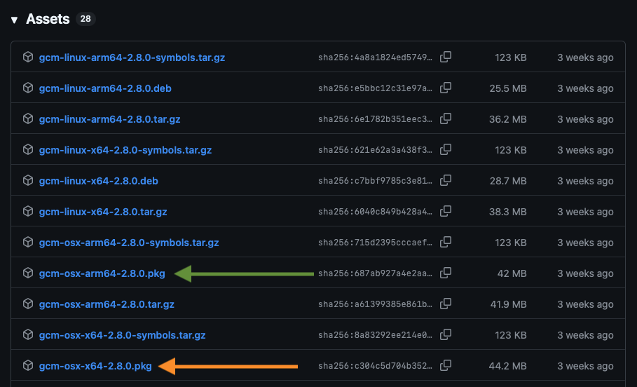
    <figcaption>Git Credential Manager Packages</figcaption>
</figure> 

If you are not sure, navigate to ` → About This Mac` on the top bar and check the processor name under **Chip**:

- `Apple *` → Download the `gcm-osx-arm64-*.pkg`,
- `Intel *` → Download the `gcm-osx-x64-*.pkg`

<figure>
    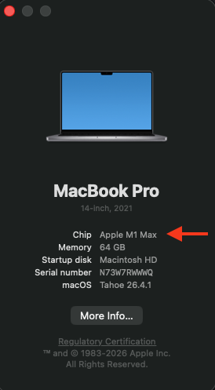
    <figcaption>About This Mac<br>(Apple/ARM64 Chip)</figcaption>
</figure> 

You can also type the `arch` command in **Terminal** to print the architecture.


## Git Configuration

### Obtaining Git Credentials

STUB

### Configuring `user.name` and `user.email`

STUB

### Alternative Method - Git SSH Credentials

STUB