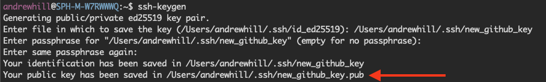
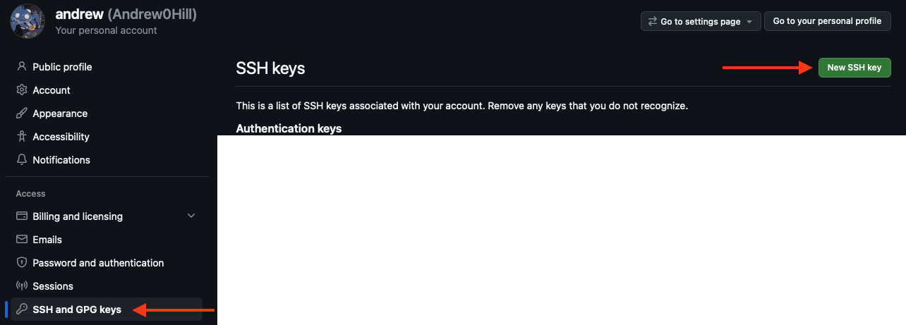
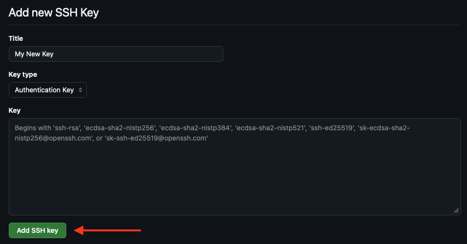
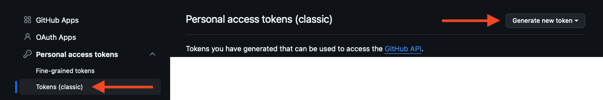
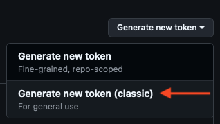
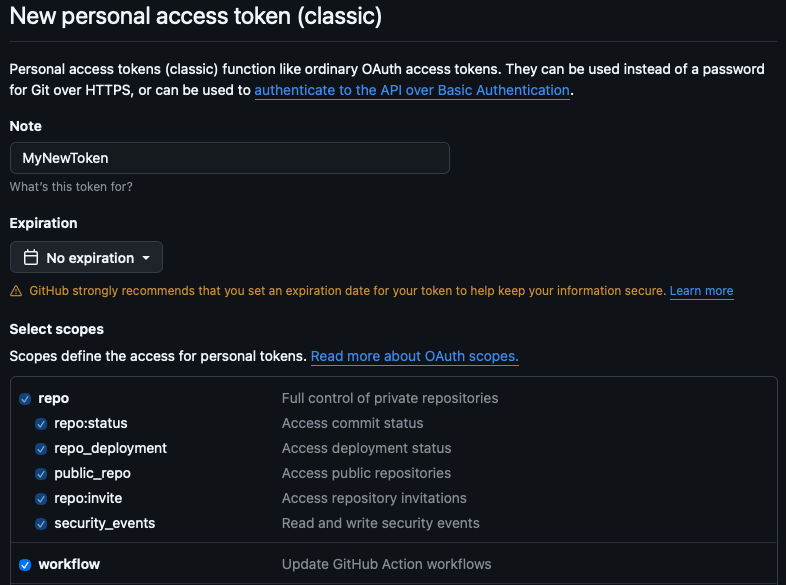
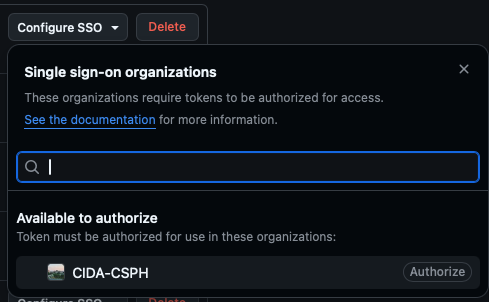

# 01 - Git/GitHub Setup

**Audience:** First-time Git/GitHub Users

This article introduces the concept of Version Control by providing some motivation and background info, then provides steps for installing Git and setting up a GitHub account.

If you already have Git/GitHub configured, feel free to skip to the [next article](github_basics_02.md) in the series.

## What is version control, and why do we need it?

Version control simply means *tracking changes to a set of files over time*, usually with the ability to access to previous versions of the files if needed.

When people refer to 'using version control', they are typically referring to the use of a **Version Control System** or **VCS**, a software tool designed to track changes and state for multiple files within a project.

For CIDA members, Git enables us to create reproducible analytical code bases, where the full history of the analysis is available to ourselves and collaborators which we choose to share it with.

!!! info
    All CIDA members are encouraged to use version control (specifically **Git** and **GitHub**) to manage code for each of their projects.

In the past, you may have encountered a situation like this:

<figure>
    
    <figcaption>'Manual' Version Control</figcaption>
</figure>

The above example shows a manual form of version control. The user is manually maintaining multiple copies/versions of report and code files and preserving older versions as they make changes.

This type of version control is functional in the short-term, but over time it can become convoluted, introduce errors, and hinder reproducibility and collaboration.

A dedicated VCS like Git is designed to solve these types of problems. Git can handle arbitrarily sized projects, and can track any type of file (Scripts/Notebooks, Reports, Tables/Figures, etc)

## Introduction to Git and Version Control

<figure>
    
    <figcaption>Git Logo</figcaption>
</figure> 

Git was first released in 2005 as an open-source tool for managing the Linux kernel source code. Since then, it has become the VCS of choice for most developers. 

<figure>
    
    <figcaption>'What are the primary version control systems you use?' <a href="https://survey.stackoverflow.co/2022#version-control-version-control-system">StackOverflow 2022 Developer Survey</a> </figcaption>
</figure>

!!! info "Fun Fact"
    The Linux kernel surpassed *40 million lines of code* in 2025, with contributions from over 5000 developers in 2025 alone. [^1]

[^1]: https://commandlinux.com/statistics/linux-kernel-contributors-lines-of-code-statistics/

Git can be used to maintain a complete version history for your project files:

- *What changes have been made to each file?*
- *Who made the changes?*
- *When were the changes made?*
<figure>
    
    <figcaption>Example of file history in a Git repository</figcaption>
</figure>

A **Git repository** is a term used to describe a group of files tracked by Git. In general, it is good practice to use **separate** Git repositories for each of your projects.

A Git repository will reside in a folder (usually the top-level folder of your project) and can track all files or subdirectories within that folder or below it (within subdirectories, etc).

*For now we just introduce the high-level concept, but in the [next article](github_basics_02.md) we will cover how to create and use a Git repository.*

## Creating a GitHub Account
<figure>
    
</figure> 

On its own, Git is a powerful version control tool. However, one of the other benefits of version control is the ability to back up code online, and *share* code with others.

To allow for this, Git has the concept of a **remote repository**, an online location which mirrors the **local repository** located on your computer.


<figure>
    
</figure>

After configuring a remote repository, you can send local changes to (**push**) or receive changes from (**pull**) the remote repository. 


Although there are many options for hosting remote Git repositories, the most popular is **GitHub**. 

To use GitHub, you must first create a GitHub account. If you are a CIDA member or employee, we recommend using your CU Anschutz email to create this account.

Once created, take note of your **GitHub Username** as well as the **Email Address** associated with your account. Both these items will be needed to configure Git.

!!! note "CIDA GitHub Organization"
    CIDA has an official GitHub organization, which members can use to store code securely and collaborate with others. If you are a new CIDA employee and need access to the CIDA GitHub organization, please email:

    <a href="mailto:cida-rt@olucdenver.onmicrosoft.com">cida-rt@olucdenver.onmicrosoft.com</a>


## Git Installation

To get started using Git, we first need to install Git on our local machine. 

!!! Example "Tip"
    If you prefer instructions in video format, video walkthroughs of the steps below are available [here on OneDrive](https://olucdenver-my.sharepoint.com/:f:/g/personal/andrew_2_hill_cuanschutz_edu/IgBaTDV-g2tnT7Im_kgZjciaARO8wuXefaq4p7H9IIyyxuo?e=kYdJaw) (CU email required) for both **Windows** and **Mac**.

### 1. Check for existing Git installation

Before installing Git, we can check to see if Git is already installed on the machine.

Open a **Terminal** (Mac) or **Powershell** (Windows) window, type `git`, and press Enter.

On **Windows**, a message like:

```
git : The term 'git' is not recognized as the name of a cmdlet...
```
indicates that `git` is not yet installed.

On **Mac**, attempting to execute `git` when it is not installed will produce a mesage like:

```
xcode-select: note: No developer tools were found, requesting install.
```

and trigger a pop-up prompt to install the `Command Line Developer Tools`. 

*(If Git is not installed, continue to the Step 2 for your operating system)*

### 2. Installing Git (Windows)

On Windows, you can download Git from the official Git website ([https://git-scm.com/install/](https://git-scm.com/install/)). We recommend downloading the `Git for Windows/x64 Setup`.

<figure>
    
    <figcaption>Git Download Page</figcaption>
</figure> 

After downloading, run the installer. Default installation options are fine with two exceptions:

1. We recommend setting the default branch name to `main` (from `master`)
    <figure>
        
        <figcaption>Override Default Branch Name</figcaption>
    </figure> 
2. Ensure that 'Git Credential Manager' is selected for installation along with Git.
    <figure>
        
        <figcaption>Git Credential Manager</figcaption>
    </figure> 

Once the install is complete, you can open a *new* PowerShell window to verify that Git is installed.

<figure>
    
    <figcaption>Successful Git Installation (Windows)</figcaption>
</figure> 

### 2a. Installing Git (Mac)

If you performed [Step 1](#1-check-for-existing-git-installation) on a Mac, you may have encountered a pop-up prompting you to install the Command Line Developer Tools.

<figure>
    
    <figcaption>Command-line Tools Install Prompt</figcaption>
</figure> 

Simply select **Install** and wait for installation to complete. 

After installing, you should be able to type `git` into the open **Terminal** window to verify that Git is installed.

<figure>
    
    <figcaption>Successful Git Installation (Mac)</figcaption>
</figure> 

### 2b. Installing Git Credential Manager (Mac-only)

If you are installing for **Mac**, you will need to install **Git Credential Manager** separately since this program is not included in the default Git installation (like it is for Windows).

You can download Git Credential Manager from the [Git Credential Manager GitHub repository](https://github.com/git-ecosystem/git-credential-manager/releases/): 

Under the **Assets** section, choose either `gcm-osx-arm64-*.pkg` or `gcm-osx-x64-*.pkg`, depending on your computer's architecture. 

<figure>
    
    <figcaption>Git Credential Manager Packages</figcaption>
</figure> 

If you are not sure, navigate to ` → About This Mac` on the top bar and check the processor name under **Chip**:

- `Apple *` → Download the `gcm-osx-arm64-*.pkg`,
- `Intel *` → Download the `gcm-osx-x64-*.pkg`

<figure>
    
    <figcaption>About This Mac<br>(Apple/ARM64 Chip)</figcaption>
</figure> 

You can also type the `arch` command in **Terminal** to print the architecture.


## Git Configuration

### Configuring `user.name` and `user.email`

In order for Git to attribute your commits to your account correctly, we need to provide Git with your GitHub Username and Email Address associated with your GitHub account.

You can run the folowing commands in Terminal/Powershell to configure these items:

<code>
git config --global user.name <mark>&lt;GitHub Username&gt;</mark>
</code>

<code>
git config --global user.email <mark>&lt;GitHub Email Address&gt;</mark>
</code>

!!! info "Git Credential Manager"
    Because the above commands use the `--global` flag, these two options will apply to all repositories on your computer.

    For more information about Git config options, check out [Chapter 8.1 of Pro Git (2nd Edition)](https://git-scm.com/book/en/v2/Customizing-Git-Git-Configuration).


### Obtaining Git Credentials

If you followed the above Git installation path (which installs Git Credential Manager) **you do not need to manually configure any Git credentials or tokens** on your machine.

One of the benefits of using Git Credential Manager is that it handles the token creation and permissions internally. In the next article, we will cover some basic Git operations. The first time we execute an operation that requires authentication, Git Credential Manager will prompt us to log in with Git, and then setup an access token for us. 

Feel free to move to the [next article in the series](github_basics_02.md), where we will cover basic Git/GitHub usage!

### (Optional) Alternative Methods for Git Credentials

If you are not using Git Credential Manager, or are working on a system where it is not available, you will need to use an alterative authentication solution.

As of 2026, there are multiple options for Git credentials:
<table>
    <tr>
        <th> Credential Type </th>
        <th>Pros</th>
        <th>Cons</th>
    </tr>
    <tr>
        <td>SSH Key</td>
        <td>
            <ul>
                <li>Easy to generate new keys with minimal configuration needed.</li>
                <li>'Just works'</li>
            </ul>
        </td>
        <td>
            <ul>
                <li>No fine-grained permissions control, so all repositories are accessible.</li>
            </ul>
        </td>
    </tr>
    <tr>
        <td><mark>'Classic' Token</mark></td>
        <td>
            <ul>
                <li>Simpler to configure than Fine-grained Token.</li>
                <li>Easier to configure for SSO (required for CIDA GitHub organization)</li>
                <li>Works for cloning over HTTP in environments where SSH is restricted (i.e. HPC)</li>
            </ul>
        </td>
        <td>
            <ul>
                <li>Permissions are more granular than SSH Key, but no per-repository control.</li>
            </ul>
        </td>
    </tr>
    <tr>
        <td>Fine-grained Token</td>
        <td>
            <ul>
                <li>Best permission control, can grant permissions on a per-repository level.</li>
                <li>Works for cloning over HTTP in environments where SSH is restricted (i.e. HPC)</li>
            </ul>
        </td>
        <td>
            <ul>
                <li>Potentially harder to configure for SSO (required for CIDA GitHub organization)</li>
            </ul>
        </td>
    </tr>
</table>

Of these methods, I prefer the **SSH Key** or **Classic Token** for ease of use in development.

#### Configuring an SSH Key

To configure an SSH key, you first need to generate an SSH key on your local machine. On most systems (Windows/Mac/Linux) this is easiest to accomplish using the `ssh-keygen` utility from Terminal or Powershell.

!!! note "SSH Key Creation"
    I highly recommend creating a **new** SSH key for your GitHub work, even if you already have an SSH key generated.



Once the key is created, note the path of the public key file (red arrow)

Navigate to GitHub.com, then go to Settings->SSH & GPG Keys, and click the 'New SSH key' button:



On the SSH key page, paste the full contents of the **public key** file into the box. 

The public key should start with `ssh-*`.




#### Configuring a Classic Token

To configure a Classic Token, navigate to GitHub in your browser.

Then, navigate to Settings->Developer Settings->Tokens (classic).



Click the 'Generate new token' button, then click 'Generate new token (classic)'.



On the token creation page, enter a name for the token, and choose an expiration date (or no expiration date).

You can select which permissions you want the token to have.

The minimal permissions I would use are:

- `repo` - Allows for reads/writes from your private repositories.
- `workflow` - Allows for creation of GitHub Actions workflows.



Once configured, click the 'Generate token' button at the bottom of the screen. You will have a chance to copy your token, which will be presented in the green box.

I recommend copying this token and saving into your password manager or another safe place, as you will be unable to recover this token (and will need to regenerate a new token) if you lose it!

You can now push/pull from GitHub, using the token as your password when prompted.

#### SSO Configuration

Regardless of the key method you used configured above, there is one extra step required for your token to be able to access repositories in the CIDA organization:

First, navigate to the either the Settings->Developer Settings->Tokens (classic) page (for a Classic Token) or Settings->SSH & GPG Keys (for an SSH Key).

On the tokens page, locate the token/key you created, click the 'Configure SSO' button, and then select the 'CIDA-CSPH' organization.



This will prompt you to log in with your CU credentials. Afterwards, your key/token will be authorized to access repositories in the CIDA organization.


